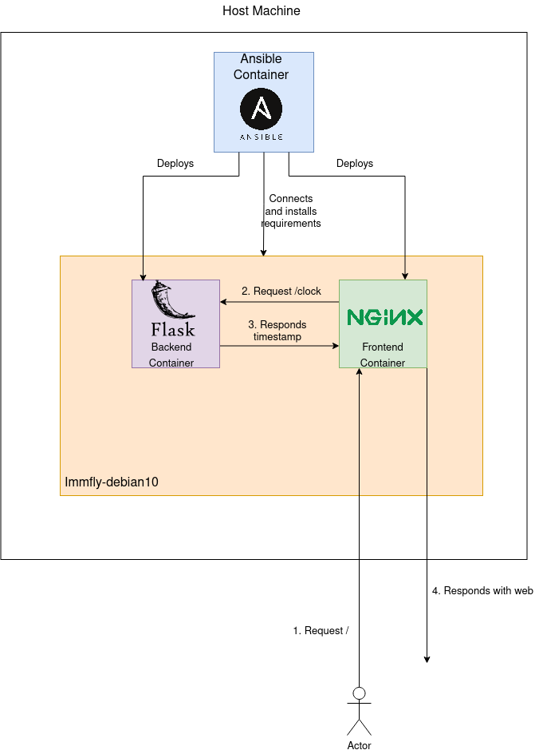

# Clock App

This repository contains all the needed files and configurations to deploy
a clock app. The app has a frontend done with HTML + CSS + Javascript. Every
second the Javascript code asks to flask backend for the timestamp to
process it and show on a web browser the actual time and date. 

## Requirements

To install this application you will need two things: the VM running in your
computer and have Docker installed in your system. Here you can find some 
guidance with it:

* [Deploy the immfly-debian10 VM](docs/vm-creation.md)
* [Docker Installation (official guide)](https://docs.docker.com/engine/install/)


## Deploying the app

Once you have acomplished this requirements you are ready to deploy the app.
To do it, you can check the following guide:

* [Deploy the Clock App](docs/app-delpoly.md)

## Architecture

In the following image you can see the architecutre of the project. 



It is made with an Ansible container that deploys the frontend and the 
backend containers inside a Debian10 VM. The requeriments of the VM are
installed through the Ansible container so we only need to deploy the VM.

The backend container just runs a Flask application that returns the Unix
timestamp in epoch format on the /clock endpoint. 

Then, we have a frontend that is pure HTML with CSS and Javascript. It
shows a clock that is updated with the Javascript that asks to the backend
container the timestamp.

## Ansible

The ansible structure is:

```
ansible
├── 00-install-web-servers.yml
├── inventory
└── roles
    └── web_servers
        ├── files
        │   └── opt
        │       └── clock-app
        │           ├── backend
        │           │   ├── app.py
        │           │   ├── Dockerfile
        │           │   └── requirements.txt
        │           ├── docker-compose.yml
        │           └── frontend
        │               ├── default.conf
        │               ├── Dockerfile
        │               └── index.html
        ├── tasks
        │   ├── install-application.yml
        │   ├── main.yml
        │   └── requeriments-intallation.yml
        └── vars
            └── main.yml
```

Is just a simple role. It has two phases, the first one installs all the 
requirements (docker.io and docker-compose). Once this is done it copies
all the files needed to deploy the application to /opt/clock-app in the
VM and then uses the docker-compose.yml file to bring everything up using
the docker collection of the Ansible community.

The playbook is run using the following command:

```
ansible-playbook -i inventory 00-install-web-servers.yml --diff
```

But you do not need to run it as it is run by the Ansible container.


